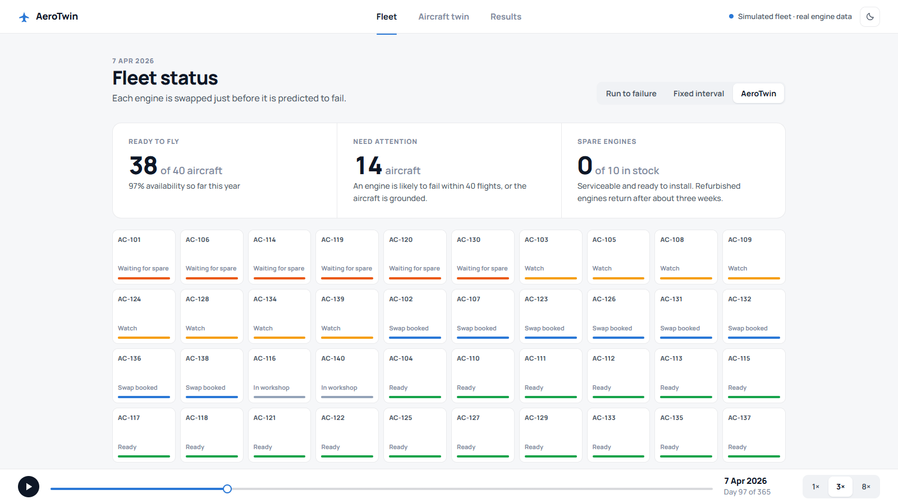
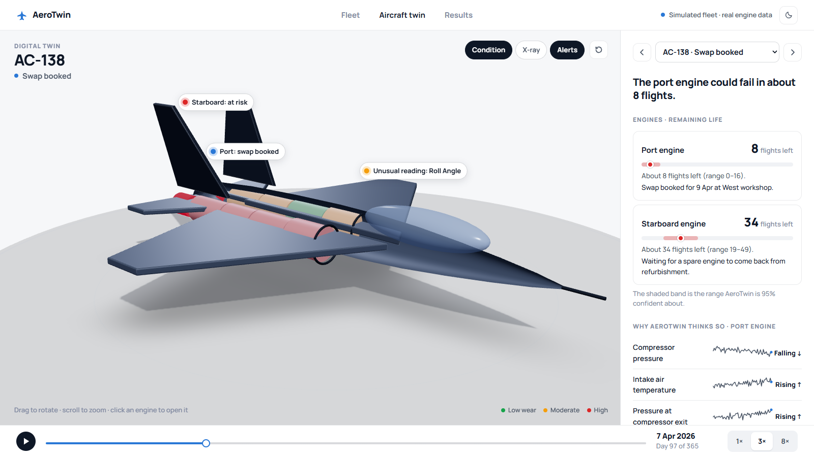
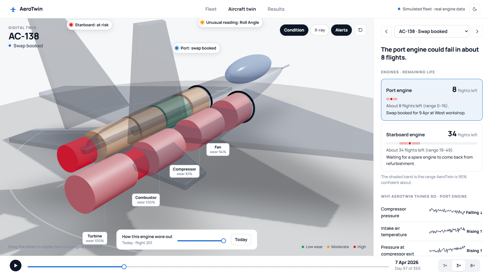
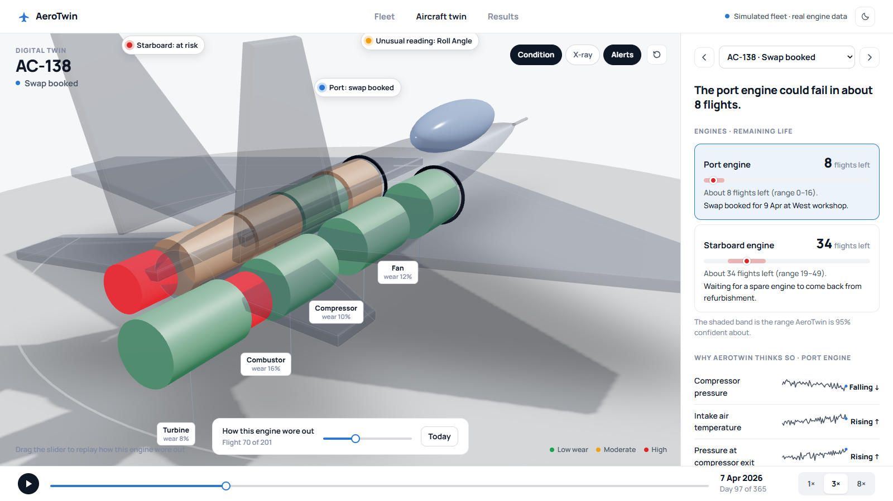
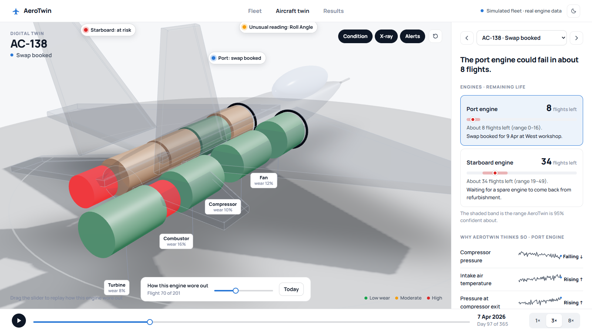
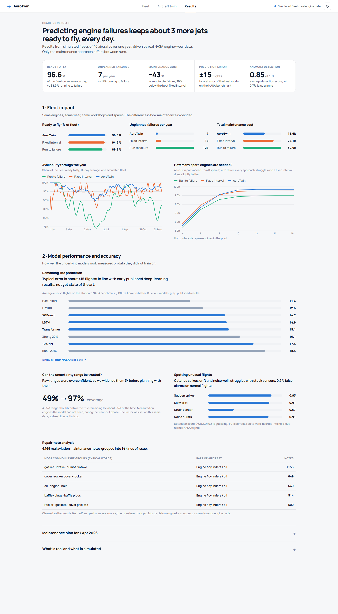
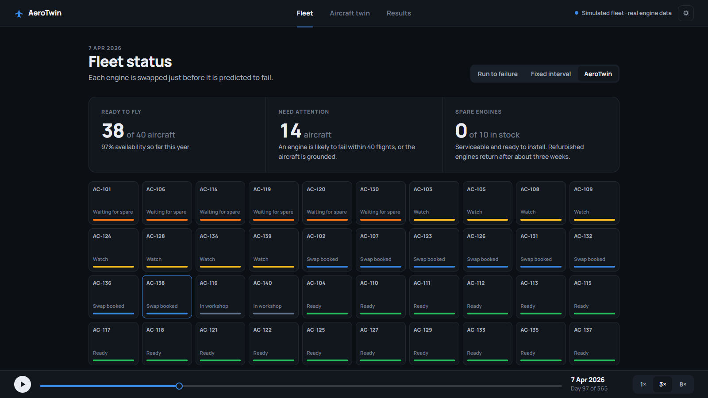
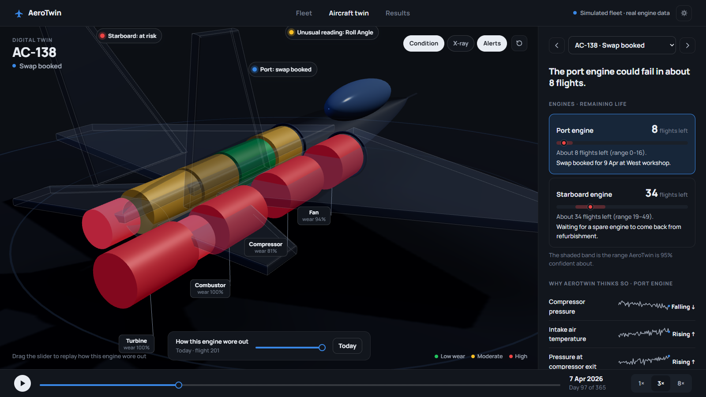

# Project Screenshots

Screenshots of the AeroTwin demo (`python -m uvicorn demo.backend.app:app`, then open http://127.0.0.1:8000). Regenerate them with `python -m demo.screenshots` (needs the app running and `playwright install chromium`).

## 01-fleet.png
Fleet tab — headline numbers (ready to fly, need attention, spare engines), the status map of all 40 aircraft, and the strategy switch (Run to failure / Fixed interval / AeroTwin).

## 02-aircraft-twin.png
Aircraft twin tab — the 3D aircraft with alert pins (unusual flight reading, swap booked, engine at risk) and a plain-language summary of each engine's remaining life.

## 03-engine-open.png
An engine opened into Fan, Compressor, Combustor and Turbine, coloured by wear, with the airframe faded so the engine is visible.

## 04-wear-slider.png
The "How this engine wore out" slider scrubbed to an earlier flight: the same engine's sections recolour as wear builds up.

## 05-xray.png
X-ray layer — the airframe turns into a ghost so both engines and their section wear are visible.

## 06-results.png
Results tab — headline scorecard, fleet impact (strategy comparison, availability through the year, spare-engine sensitivity) and model performance (prediction accuracy, uncertainty calibration, anomaly detection, repair-note analysis).

## 07-fleet-dark.png
The Fleet tab in the dark theme (toggle in the top bar).

## 08-engine-open-dark.png
An opened engine in the dark theme.

